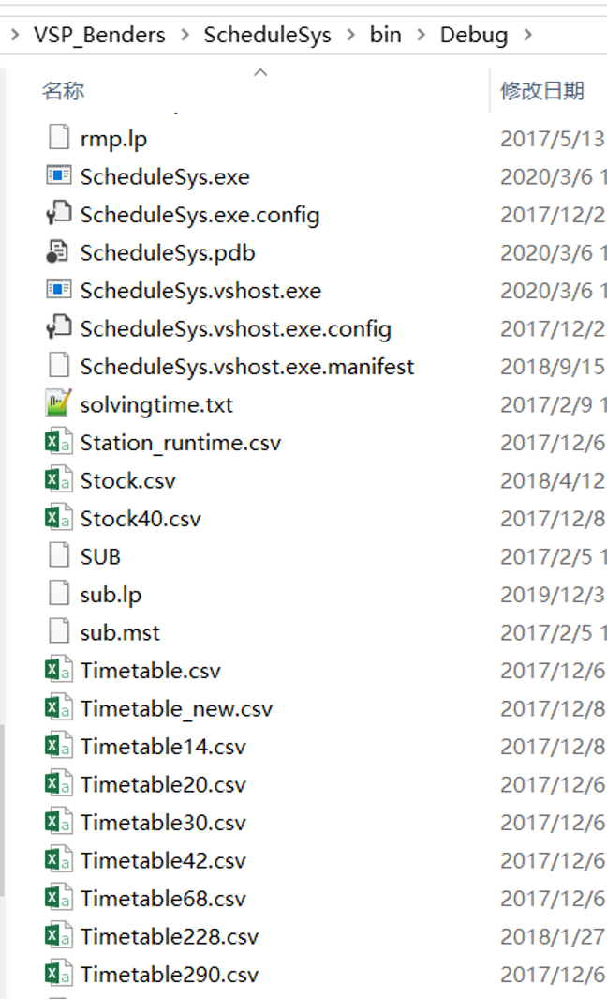
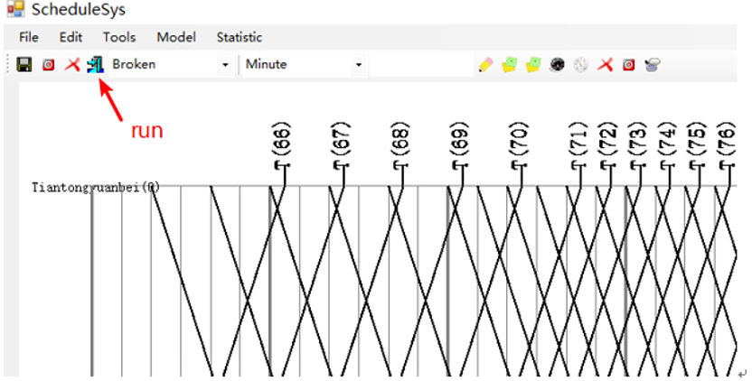
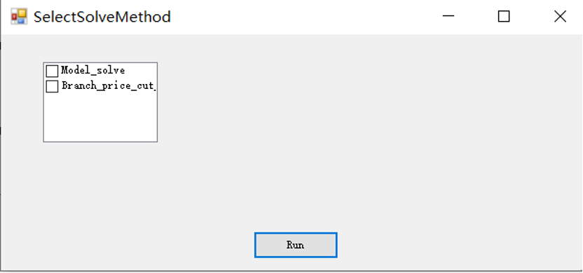

# VSP_by_Benders
The code is for the paper, "Optimizing vehicle scheduling based on variable timetable by Benders-and-Price approach"(https://downloads.hindawi.com/journals/jat/2019/2781590.pdf), accepted by Journal of Advanced Transportation(2020)

# What it can do?
In practice, vehicle scheduling is planned on a variable timetable so that the departure times of trips can be shifed in tolerable
ranges, rather than on a fxed timetable, to decrease the required feet size. This paper investigates the vehicle scheduling problem
on a variable timetable with the constraint that each vehicle can perform limited trips. Since the connection-based model is difcult
to solve by optimization sofware for a medium-scale or large-scale instance, a designed path-based model is developed. A Bendersand-Price algorithm by combining the Benders decomposition and column generation is proposed to solve the LP-relaxation of
the path-based model, and a bespoke Branch-and-Price is used to obtain the integer solution. Numerical experiments indicate that
a variable timetable approach can reduce the required feet size with a tolerable timetable deviation in comparison with a fxed
timetable approach. Moreover, the proposed algorithm is greatly superior to GUROBI in terms of computational efciency and
guarantees the quality of the solution.
# Getting Started
1.	This program is coded in Visual studio with winform by C#, and the solver is GUROBI. Thus, to start with this program please first install those software;
2.	The test cases are in the files as follows, Timetable14.csv, Timetable20.csv..are the cases with different number of trips in vehicle scheduling. If you want to test the case with 14 trips, you just change the name “Timetable14.csv” to “Timetable.csv”, since the problem always read the file “Timetable.csv”;

3.	In visual studo, you start the program. The Form as the follows you can see. Click the button the red arrow points to.

4.	Then you should select the solution method. The “model_solve” is refer to the arc-based model solved by GUROBI, and “Branch_price_cut” is refer to the path-based model solved by the algorithm that combines Benders decomposition and Column generation.

